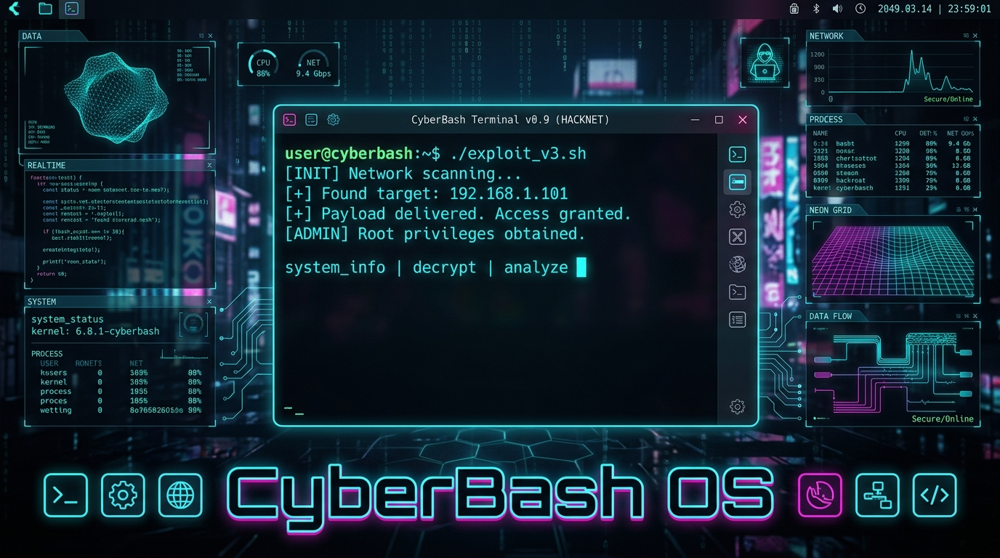
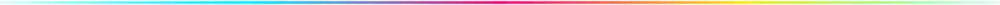
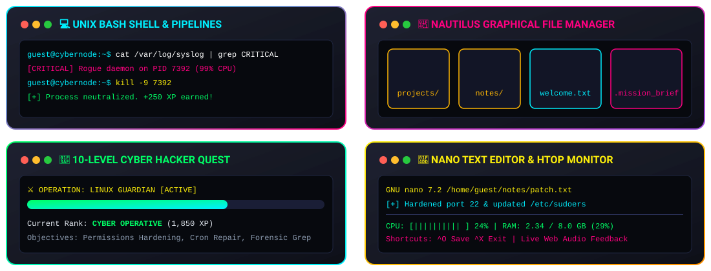
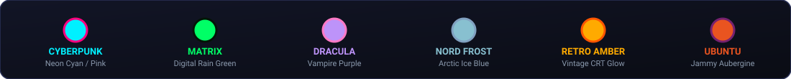
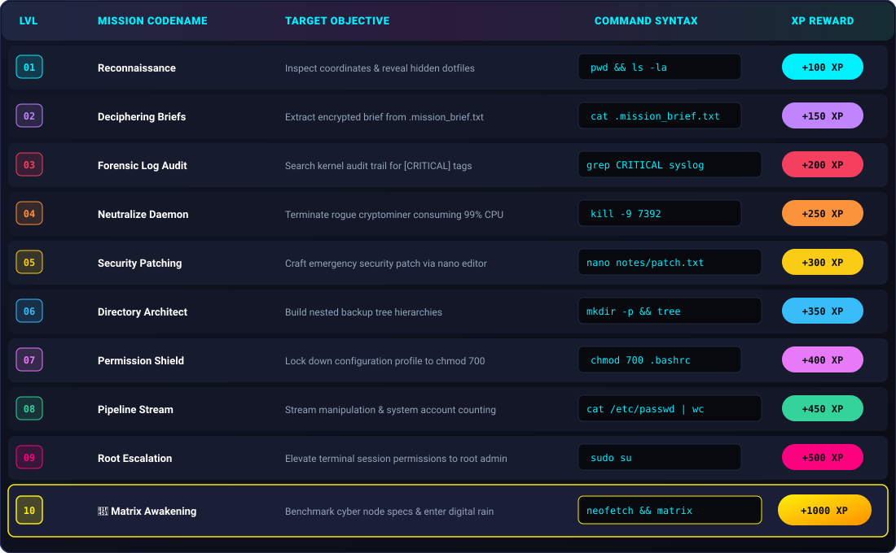
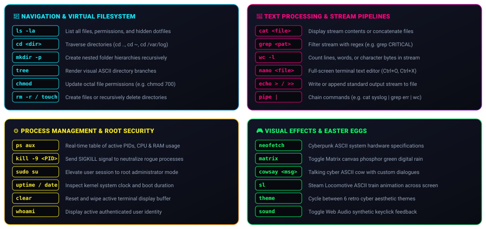
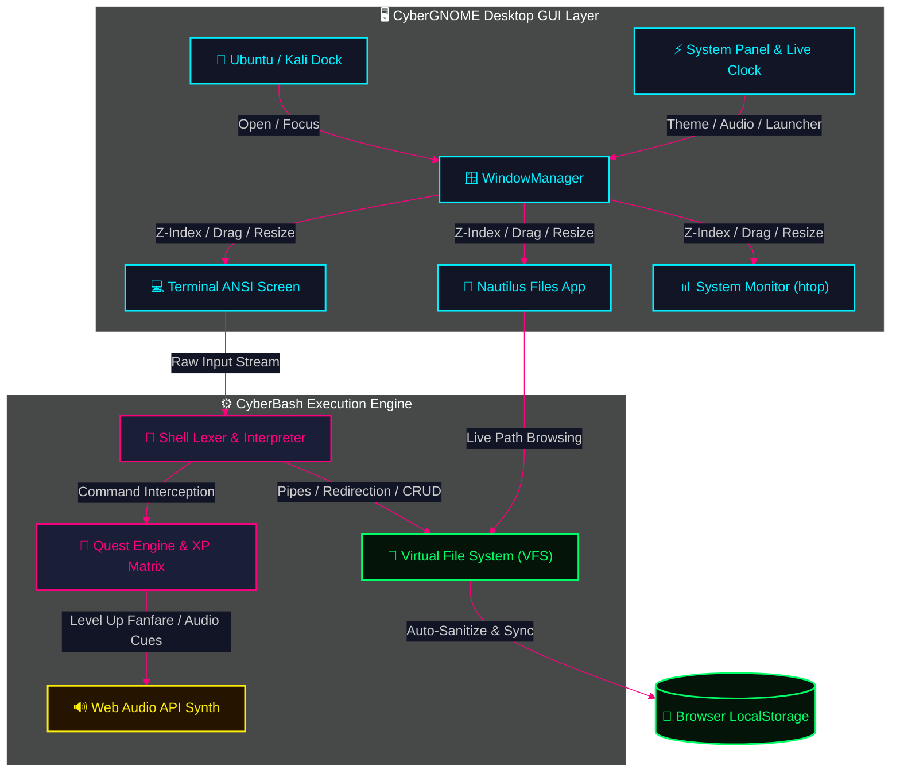
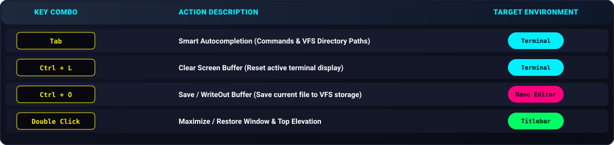

<p align="center" id="top">
  <a href="#top">
    
  </a>
</p>

<br/>

<p align="center">
  <a href="#top">
    
  </a>
</p>

<br/>

<p align="center">
  
  &nbsp;
  
  &nbsp;
  
</p>
<p align="center">
  
  &nbsp;
  
  &nbsp;
  
</p>

<br/>

<p align="center">
  <a href="https://nivedreddy6.github.io/cyberbash-os/" target="_blank" rel="noopener noreferrer"></a>
  &nbsp;
  <a href="#overview"></a>
  &nbsp;
  <a href="#features"></a>
  &nbsp;
  <a href="#quests"></a>
</p>
<p align="center">
  <a href="#commands"></a>
  &nbsp;
  <a href="#architecture"></a>
  &nbsp;
  <a href="#shortcuts"></a>
</p>

<p align="center">
  <a href="#top"></a>
</p>

> [!TIP]
> ### ⚡ Live Web Deployment Ready!
> **Experience CyberBash OS directly in your browser with zero installation:**  
> 👉 **[https://nivedreddy6.github.io/cyberbash-os/](https://nivedreddy6.github.io/cyberbash-os/)**

---

<a id="overview"></a>
## 🌌 System Overview

> [!IMPORTANT]
> **CyberBash OS** is a gamified, retro-futuristic **Linux GUI Desktop Environment**, **Interactive Unix Shell**, and **Cyber Security Simulator**. Built with **zero framework overhead** (Vanilla ES6 Modules, Hardware-Accelerated CSS3, Dynamic Canvas Digital Rain, and Web Audio Synthesizers), it runs completely client-side in any modern browser.

<p align="center">
  <a href="#top"></a>
</p>

<a id="features"></a>
## ⚡ Core Feature Matrix

<p align="center">
  <a href="#top">
    
  </a>
</p>

<p align="center">
  <a href="#top"></a>
</p>

<a id="themes"></a>
## 🎨 6 Neon Aesthetic Themes

<p align="center">
  <a href="#top">
    
  </a>
</p>

<p align="center">
  <a href="#top"></a>
</p>

<a id="quests"></a>
## 🎯 10-Level Hacker Quest Manifest

<p align="center">
  <a href="#top">
    
  </a>
</p>

<p align="center">
  <a href="#top"></a>
</p>

<a id="commands"></a>
## 📖 Full Command Lab Reference

<p align="center">
  <a href="#top">
    
  </a>
</p>

<p align="center">
  <a href="#top"></a>
</p>

<a id="architecture"></a>
## 🏗️ Architecture & Data Flow



<p align="center">
  <a href="#top"></a>
</p>

<a id="shortcuts"></a>
## ⌨️ Desktop Keyboard Shortcuts

<p align="center">
  <a href="#top">
    
  </a>
</p>

<p align="center">
  <a href="#top"></a>
</p>

## 🚀 Quick Run Locally

```bash
# 1. Clone the repository
git clone https://github.com/Nivedreddy6/cyberbash-os.git
cd cyberbash-os

# 2. Start the lightweight Node server
node server.js

# 3. Open in your browser:
# http://localhost:3000
```

---

<p align="center">
  
  
</p>
