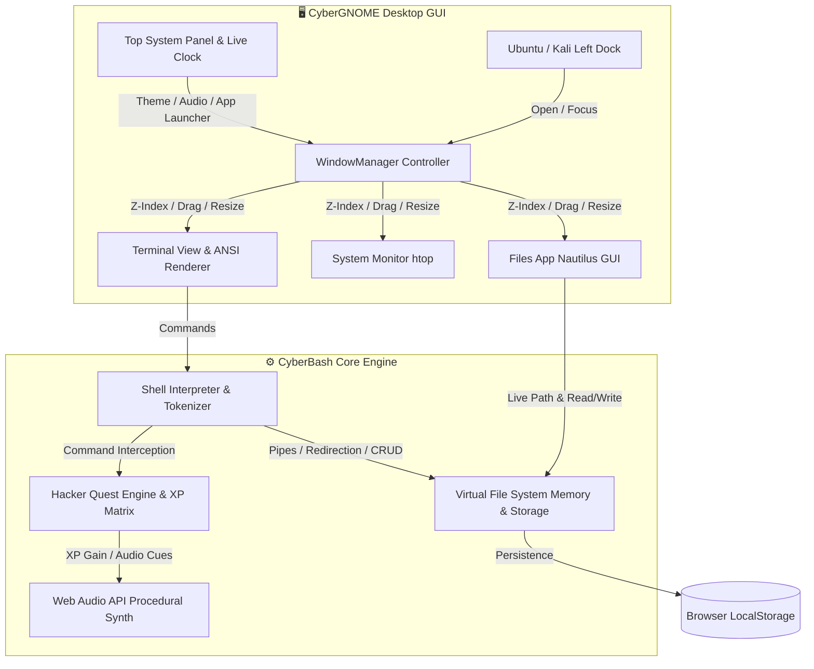

<p align="center">
  
</p>

<p align="center">
  <a href="https://git.io/typing-svg">
    
  </a>
</p>

<p align="center">
  
  
  
  
  
</p>

<p align="center">
  <a href="#-quick-deploy--live-demo"></a>
  <a href="#-10-level-hacker-quest-matrix"></a>
  <a href="#-full-command-lab-reference"></a>
  <a href="#%EF%B8%8F-desktop-architecture"></a>
</p>

---

## 🌌 The Mission

> **CyberBash OS** transforms your browser into a full-featured, retro-futuristic **Linux GUI Desktop Environment**, **Interactive Bash Shell Interpreter**, and **Gamified Hacker Quest Simulator** (*"Operation: Linux Guardian"*). 
>
> Built entirely with **Zero Heavy Frameworks** (Vanilla ES6 Modules, Hardware-Accelerated CSS3, Dynamic Canvas Digital Rain, and Web Audio Synthesizers), it provides instantaneous boot times and an authentic Unix terminal workflow.

---

## ⚡ Interactive Feature Showcase

<table>
  <tr>
    <td width="50%">
      <h3 align="center">🖥️ Authentic Unix Shell & Piping</h3>
      <p>Execute real command pipelines with stream redirection, process isolation, and environment variables:</p>
      <pre><code><span style="color: #00f0ff;">guest@cybernode</span>:<span style="color: #fcee0a;">~</span>$ cat /var/log/syslog | grep CRITICAL | wc -l
<span style="color: #00ff66;">4</span>
<span style="color: #00f0ff;">guest@cybernode</span>:<span style="color: #fcee0a;">~</span>$ ps aux | grep crypto
<span style="color: #ff007f;">7392  guest  99.4%  ./cryptominer</span>
<span style="color: #00f0ff;">guest@cybernode</span>:<span style="color: #fcee0a;">~</span>$ kill -9 7392
<span style="color: #00ff66;">[+] Process 7392 terminated.</span></code></pre>
    </td>
    <td width="50%">
      <h3 align="center">📁 Nautilus Graphical File Manager</h3>
      <p>Dual-pane visual VFS explorer with reactive directory breadcrumbs, permission badges, and instant file inspection:</p>
      <ul>
        <li>🗂️ <strong>Hierarchical Virtual VFS</strong> (<code>/bin</code>, <code>/etc</code>, <code>/home/guest</code>, <code>/var/log</code>)</li>
        <li>⚡ <strong>Click Navigation & Fast Preview</strong></li>
        <li>📝 <strong>One-Click Nano Editor Integration</strong></li>
        <li>💾 <strong>Real-time <code>localStorage</code> Persistence</strong></li>
      </ul>
    </td>
  </tr>
  <tr>
    <td width="50%">
      <h3 align="center">📝 GNU Nano Full-Screen Editor</h3>
      <p>In-terminal text editor with keyboard shortcuts (<code>Ctrl+O</code> to write out, <code>Ctrl+X</code> to exit) and live state tracking:</p>
      <pre><code>  GNU nano 7.2         /home/guest/notes/patch.txt

  [+] SEC_PATCH_09: Hardened firewall rules
  [+] Escalated guest permissions to sys_admin
  
^G Get Help  ^O WriteOut  ^R Read File  ^X Exit</code></pre>
    </td>
    <td width="50%">
      <h3 align="center">🎨 6 Retro Themes & Audio Synth</h3>
      <p>Tailored cyberpunk aesthetic engine with procedural soundscapes:</p>
      <ul>
        <li>✨ <strong>Cyberpunk Neon</strong>, <strong>Matrix Rain</strong>, <strong>Dracula Dark</strong></li>
        <li>❄️ <strong>Nord Frost</strong>, <strong>Amber CRT Retro</strong>, <strong>Ubuntu Jammy</strong></li>
        <li>🔊 <strong>Web Audio Synthesizer</strong> (Mechanical clicks & fanfare)</li>
        <li>📺 <strong>Real-time Phosphor CRT Scanline Simulation</strong></li>
      </ul>
    </td>
  </tr>
</table>

---

## 🎯 10-Level Hacker Quest Matrix

<details open>
<summary><b>🔥 Click to expand "Operation: Linux Guardian" Level Walkthrough</b></summary>
<br/>

| Level | Mission Codename | Objective Description | Command Pattern | XP Reward |
| :---: | :--- | :--- | :--- | :---: |
| `01` | **Reconnaissance** | Inspect current coordinates and reveal all hidden files | `pwd && ls -la` | `+100 XP` |
| `02` | **Deciphering Briefs** | Extract encrypted intelligence brief from hidden dotfiles | `cat .mission_brief.txt` | `+150 XP` |
| `03` | **Forensic Log Audit** | Search kernel audit trail in syslog for breach notices | `grep CRITICAL /var/log/syslog` | `+200 XP` |
| `04` | **Neutralize Daemon** | Locate and terminate rogue high-CPU cryptominer PID | `kill 7392` | `+250 XP` |
| `05` | **Security Patching** | Craft emergency security patch in notes directory | `nano notes/security_patch.txt` | `+300 XP` |
| `06` | **Directory Architect** | Construct nested backup hierarchies & render tree | `mkdir -p backups/logs && tree`| `+350 XP` |
| `07` | **Permission Shield** | Harden permissions on configuration profile to 700 | `chmod 700 .bashrc` | `+400 XP` |
| `08` | **Pipeline Stream** | Master stream manipulation to count system accounts | `cat /etc/passwd \| wc -l` | `+450 XP` |
| `09` | **Root Escalation** | Elevate terminal session security privileges | `sudo su` | `+500 XP` |
| `10` | **Matrix Awakening** | Benchmark system specifications and enter the grid | `neofetch && matrix` | `+1000 XP` |

</details>

---

## 🛠️ Full Command Lab Reference

```bash
# NAVIGATION & FILESYSTEM
ls -la           # List all files including hidden dotfiles with permissions
cd <dir>         # Navigate through directory hierarchies (cd .., cd ~, cd /)
pwd              # Print absolute working directory path
mkdir -p <dir>   # Create nested folder structures recursively
touch <file>     # Instantiate empty file or refresh timestamp
rm -r <target>   # Remove file or recursively delete directories
tree             # Render visual ASCII directory hierarchy
chmod <mode>     # Update octal permissions (e.g., chmod 755, chmod 700)

# TEXT PROCESSING & PIPELINES
cat <file>       # Display file stream content
grep <pattern>   # Regex pattern matching (e.g., grep -i "critical" /var/log/syslog)
wc -l <file>     # Count lines, words, or character bytes in stream
nano <file>      # Interactive full-screen terminal text editor
echo "text" > f  # Overwrite file with text stream
echo "text" >> f # Append text stream to file

# PROCESS MANAGEMENT & SYSTEM
ps aux           # Display real-time active system daemons & resource consumption
kill -9 <PID>    # Terminate process by Process ID
sudo su          # Elevate session privileges to root administrative mode
date / uptime    # Inspect system clock and operational duration
clear / Ctrl+L   # Clear terminal screen buffer

# EASTER EGGS & VISUAL EFFECTS
neofetch         # Display cyberpunk ASCII logo and system hardware specs
matrix           # Toggle Matrix canvas digital green phosphor rain
cowsay <msg>     # Configurable talking cyber ASCII cow
sl               # Steam Locomotive ASCII train animation
```

---

## 🏗️ Desktop Architecture



---

## ⌨️ Desktop Keyboard Shortcuts

| Shortcut | Action | Scope |
| :--- | :--- | :--- |
| <kbd>Tab</kbd> | **Smart Autocompletion** (Commands & VFS Paths) | Terminal |
| <kbd>↑</kbd> / <kbd>↓</kbd> | **Command History Navigation** | Terminal |
| <kbd>Ctrl</kbd> + <kbd>L</kbd> | **Clear Screen Buffer** | Terminal |
| <kbd>Ctrl</kbd> + <kbd>C</kbd> | **Interrupt / SIGINT** | Terminal |
| <kbd>Ctrl</kbd> + <kbd>O</kbd> | **Save / WriteOut File** | Nano Editor |
| <kbd>Ctrl</kbd> + <kbd>X</kbd> | **Exit Editor** | Nano Editor |
| <kbd>Double Click</kbd> | **Maximize / Restore Window** | Window Titlebar |

---

## 🚀 Quick Deploy & Live Demo

### 1. Run with Node.js
```bash
git clone https://github.com/Nivedreddy6/linux.git
cd linux
node server.js
# Access at http://localhost:3000
```

### 2. Run with Python
```bash
python -m http.server 3000
```

### 3. Deploy to GitHub Pages
The project is built with static ES6 web modules with zero build steps required. Simply enable **GitHub Pages** on the `main` branch under **Settings > Pages**.

---

<p align="center">
  <sub>Engineered with ⚡ by <a href="https://github.com/Nivedreddy6"><strong>Nivedreddy6</strong></a> // Licensed under <strong>MIT</strong></sub>
</p>
