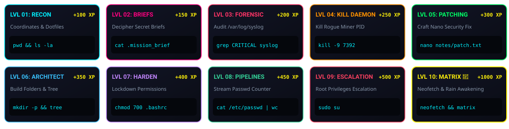
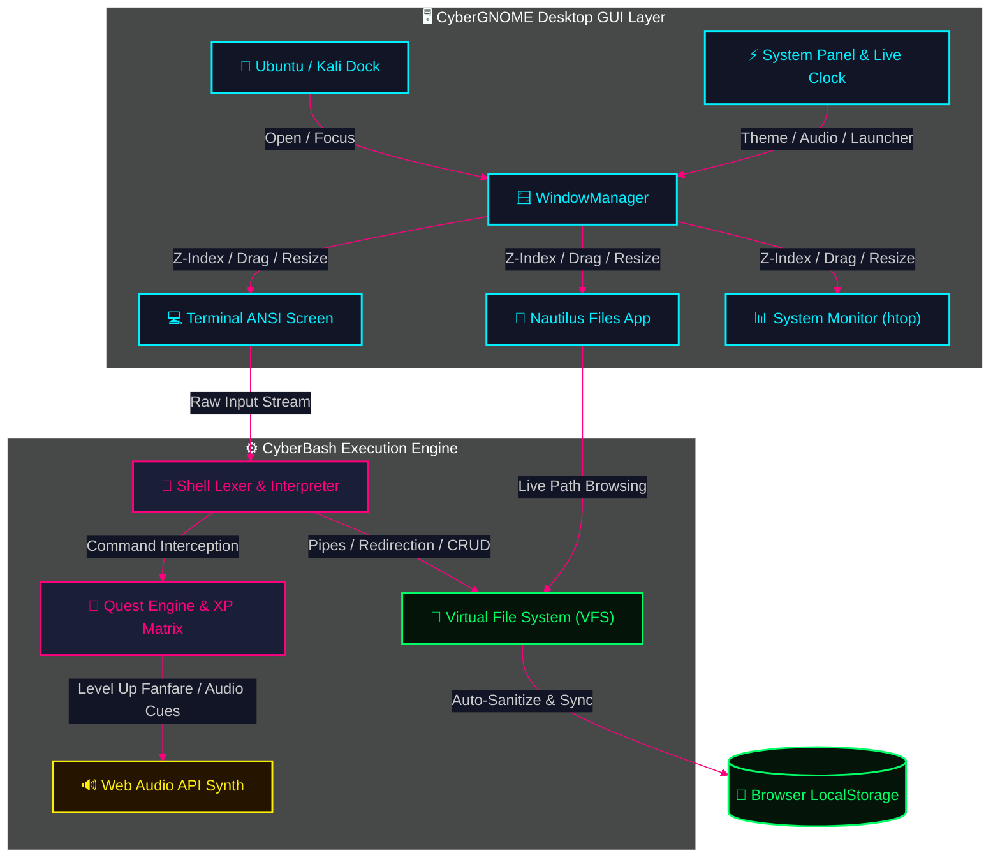

<p align="center">
  <a href="https://nivedreddy6.github.io/cyberbash-os/" target="_blank" rel="noopener noreferrer">
    
  </a>
</p>

<p align="center">
  <a href="https://nivedreddy6.github.io/cyberbash-os/" target="_blank" rel="noopener noreferrer">
    
  </a>
</p>

<p align="center">
  
  
  
  
  
  
</p>

<p align="center">
  <a href="https://nivedreddy6.github.io/cyberbash-os/"></a>
  <a href="#-10-level-hacker-quest-roadmap"></a>
  <a href="#-full-command-lab-reference"></a>
</p>

<p align="center">
  
</p>

> [!TIP]
> ### ⚡ Live Web Deployment Ready!
> **Experience CyberBash OS directly in your browser with zero installation:**  
> 👉 **[https://nivedreddy6.github.io/cyberbash-os/](https://nivedreddy6.github.io/cyberbash-os/)**

---

## 🌌 System Overview

> [!IMPORTANT]
> **CyberBash OS** is a gamified, retro-futuristic **Linux GUI Desktop Environment**, **Interactive Unix Shell**, and **Cyber Security Simulator**. Built with **zero framework overhead** (Vanilla ES6 Modules, Hardware-Accelerated CSS3, Dynamic Canvas Digital Rain, and Web Audio Synthesizers), it runs completely client-side in any modern browser.

<p align="center">
  
</p>

## ⚡ Core Feature Matrix

<p align="center">
  
</p>

<p align="center">
  
</p>

## 🎨 6 Neon Aesthetic Themes

<p align="center">
  
</p>

<p align="center">
  
</p>

## 🎯 10-Level Hacker Quest Roadmap

<p align="center">
  
</p>

> [!NOTE]
> ### 🛡️ Operation: Linux Guardian — Mission Manifest

| Level | Badge | Mission Codename | Target Objective | Command Syntax | XP Reward |
| :---: | :---: | :--- | :--- | :--- | :---: |
| `01` | 🟢 | **Reconnaissance** | Inspect current coordinates & reveal hidden dotfiles | `pwd && ls -la` | **`+100 XP`** |
| `02` | 🟣 | **Deciphering Briefs** | Extract encrypted intelligence brief from `.mission_brief.txt` | `cat .mission_brief.txt` | **`+150 XP`** |
| `03` | 🔴 | **Forensic Log Audit** | Search kernel audit trail for `[CRITICAL]` breach flags | `grep CRITICAL /var/log/syslog` | **`+200 XP`** |
| `04` | 🟠 | **Neutralize Daemon** | Terminate rogue cryptominer consuming 99% CPU | `kill 7392` | **`+250 XP`** |
| `05` | 🟡 | **Security Patching** | Craft emergency security patch using `nano` editor | `nano notes/security_patch.txt` | **`+300 XP`** |
| `06` | 🔵 | **Directory Architect**| Build nested backup hierarchies & diagram tree | `mkdir -p backups/logs && tree` | **`+350 XP`** |
| `07` | 🟣 | **Permission Shield** | Harden permissions on configuration profile to `700` | `chmod 700 .bashrc` | **`+400 XP`** |
| `08` | 🟢 | **Pipeline Stream** | Master stream manipulation to count system accounts | `cat /etc/passwd \| wc -l` | **`+450 XP`** |
| `09` | 🔴 | **Root Escalation** | Elevate session permissions to root administrative mode | `sudo su` | **`+500 XP`** |
| `10` | 👑 | **Matrix Awakening** | Benchmark cyber node hardware & enter digital rain | `neofetch && matrix` | **`+1000 XP`** |

<p align="center">
  
</p>

## 📖 Full Command Lab Reference

```bash
# ==============================================================================
# 📂 NAVIGATION & VIRTUAL FILE SYSTEM
# ==============================================================================
ls -la           # List all files including hidden dotfiles with permissions & sizes
cd <directory>   # Navigate directories (cd .., cd ~, cd /var/log, cd projects)
pwd              # Print working directory absolute path
mkdir -p <dir>   # Create nested folder hierarchies recursively
touch <file>     # Instantiate empty file or refresh timestamp
rm -r <target>   # Remove file or recursively delete directories
tree             # Render visual ASCII directory hierarchy
chmod <mode>     # Update octal permissions (e.g., chmod 755 script.py, chmod 700 .bashrc)

# ==============================================================================
# 📝 TEXT PROCESSING & STREAM PIPELINES
# ==============================================================================
cat <file>       # Display file stream content or concatenate files
grep <pattern>   # Regex pattern matching (e.g., grep -i "critical" /var/log/syslog)
wc -l <file>     # Count lines, words, or character bytes in stream
nano <file>      # Interactive full-screen terminal text editor (Ctrl+O, Ctrl+X)
echo "text" > f  # Overwrite file with text stream
echo "text" >> f # Append text stream to file

# ==============================================================================
# ⚙️ PROCESS MANAGEMENT & SYSTEM UTILITIES
# ==============================================================================
ps aux           # Display real-time active system daemons, PIDs, and CPU/RAM usage
kill -9 <PID>    # Terminate process by Process ID
sudo su          # Elevate session privileges to root administrative mode
date / uptime    # Inspect system clock and uptime duration
clear / Ctrl+L   # Clear terminal screen buffer

# ==============================================================================
# 🎮 EASTER EGGS & VISUAL EFFECTS
# ==============================================================================
neofetch         # Display cyberpunk ASCII logo and system hardware specs
matrix           # Toggle Matrix canvas digital green phosphor rain
cowsay <msg>     # Configurable talking cyber ASCII cow
sl               # Steam Locomotive ASCII train animation
```

<p align="center">
  
</p>

## 🏗️ Architecture & Data Flow



<p align="center">
  
</p>

## ⌨️ Desktop Keyboard Shortcuts

| Key Combo | Action Description | Target Window |
| :--- | :--- | :---: |
| <kbd>Tab</kbd> | **Smart Autocompletion** (Commands & VFS Directory Paths) | `Terminal` |
| <kbd>↑</kbd> / <kbd>↓</kbd> | **Command History Navigation** (Cycle previous commands) | `Terminal` |
| <kbd>Ctrl</kbd> + <kbd>L</kbd> | **Clear Screen Buffer** (Reset terminal display) | `Terminal` |
| <kbd>Ctrl</kbd> + <kbd>C</kbd> | **Interrupt / SIGINT** (Cancel active command) | `Terminal` |
| <kbd>Ctrl</kbd> + <kbd>O</kbd> | **WriteOut / Save File** | `Nano Editor` |
| <kbd>Ctrl</kbd> + <kbd>X</kbd> | **Exit Editor** | `Nano Editor` |
| <kbd>Double Click</kbd> | **Maximize / Restore Window** | `Titlebar` |

<p align="center">
  
</p>

## 🚀 Quick Run Locally

```bash
# 1. Clone the repository
git clone https://github.com/Nivedreddy6/cyberbash-os.git
cd cyberbash-os

# 2. Start the lightweight Node server
node server.js

# 3. Open in your browser:
# http://localhost:3000
```

---

<p align="center">
  
  
</p>
